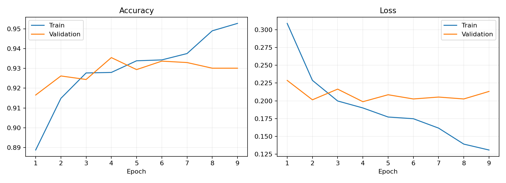
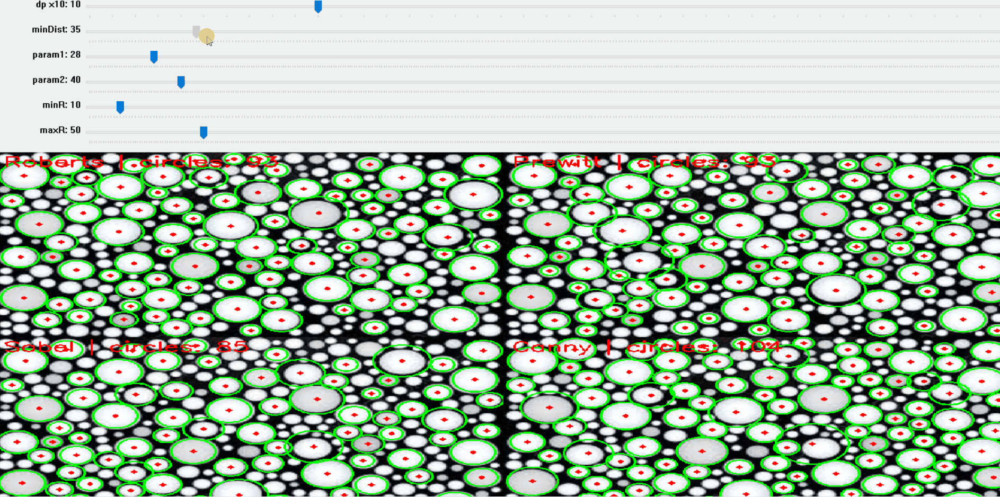
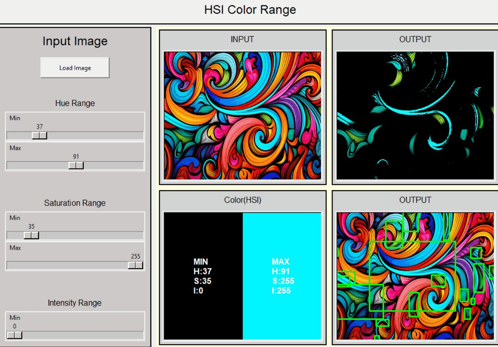

# Computer Vision Coursework & Projects

รวมผลงานและแบบฝึกหัดในรายวิชา Computer Vision ครอบคลุมตั้งแต่การประมวลผลภาพดิจิทัลพื้นฐาน การวิเคราะห์คุณลักษณะภาพ อัลกอริทึมการบีบอัดข้อมูล ไปจนถึงการประยุกต์ใช้ Deep Learning เพื่อจำแนกภาพ

---

## 1. Mini Project 2 — Scene Classification (AI จำแนกภาพฉาก)

มินิโปรเจกต์พัฒนาโมเดลจำแนกประเภทภาพทิวทัศน์และสภาพแวดล้อม 6 หมวดหมู่ (อาคาร, ป่าไม้, ธารน้ำแข็ง, ภูเขา, ทะเล และถนน) โดยใช้สถาปัตยกรรม EfficientNetB0 (Transfer Learning) พร้อมสร้างเว็บแอปพลิเคชันสำหรับทดสอบโมเดลด้วย Gradio


- **ความแม่นยำ:** ได้รับค่า Validation Accuracy ประมาณ 93% (Training Accuracy ~95%)
- **การทดสอบใช้งาน:** มีไฟล์ `app.py` สำหรับเปิดเว็บเบราว์เซอร์ให้อัปโหลดภาพและแสดงผลลัพธ์เปอร์เซ็นต์ความมั่นใจของโมเดลทันที
- [ดูโค้ดและรายละเอียดโมเดลฉบับเต็ม](mini-project-02-scene-classification/README.md)



---

## 2. Mini Project 1 — Edge Detection & Hough Transform

การทดลองและเปรียบเทียบอัลกอริทึมการตรวจจับขอบภาพ 4 รูปแบบ (Roberts, Prewitt, Sobel และ Canny) พร้อมประยุกต์ใช้ Hough Transform ในการตรวจจับรูปทรงเรขาคณิต เช่น เส้นตรง (Hough Lines) และวงกลม (Hough Circles)




- **การทำงาน:** มีหน้าต่าง Interactive Trackbar สำหรับปรับแต่งค่าพารามิเตอร์การตรวจจับวงกลมแบบเรียลไทม์
- [ดูโค้ดและวิธีรันโปรเจกต์](mini-project-01-edge-hough/README.md)

---

## 3. Color Processing & Segmentation (การแยกสี)

การวิเคราะห์และประมวลผลภาพสีด้วยปริภูมิสี HSI/HSV โดยกำหนดช่วงค่าสี (Color Range Thresholding) เพื่อคัดแยกเฉพาะส่วนของสีหรือวัตถุที่ต้องการออกจากภาพ



---

## 4. Python Labs

| แลป | รายละเอียดการทำงาน |
|---|---|
| [Lab 1 — Noise Filtering](labs/lab-01-noise-filtering/main.py) | แปลงภาพเป็นระดับสีเทา และเขียนตัวกรอง Average Filter กับ Median Filter เพื่อลดสัญญาณรบกวนแบบ Gaussian และ Salt-and-Pepper |
| [Lab 2 — Otsu Threshold](labs/lab-02-otsu/main.py) | คำนวณฮิสโทแกรม ค้นหาค่าขีดแบ่งที่เหมาะสมด้วยวิธี Otsu และแปลงภาพเป็นไบนารี (ขาวดำ) |

### วิธีติดตั้งและรันแลป

ใช้ Python 3.10 ในการรัน และติดตั้งไลบรารีที่จำเป็น:

```sh
pip install -r requirements.txt
```

เข้าโฟลเดอร์แลปที่ต้องการก่อนรันคำสั่ง `python main.py` เพื่อให้โปรแกรมเรียกอ่านไฟล์ภาพในโฟลเดอร์ `pic` ได้ถูกต้อง

*Lab 2 ทำร่วมกับ พัชณพงศ์ พงศ์พิมพ์*

---

## 5. Theory Coursework (แบบฝึกหัดทฤษฎี)

### Texture Segmentation — GLCM (Gray-Level Co-occurrence Matrix)
การสกัดคุณลักษณะเนื้อสัมผัสของภาพโดยการสร้างเมทริกซ์การเกิดร่วมระดับสีเทา (GLCM) จากพิกเซลในทิศทางต่าง ๆ พร้อมคำนวณค่า Contrast, Similarity และ Dissimilarity เพื่อใช้ในการแบ่งส่วนภาพ


[ดูเอกสารและผลการคำนวณฉบับเต็ม (10 หน้า)](texture-segmentation/answers.pdf)

### Huffman Coding
การบีบอัดข้อมูลภาพแบบไม่สูญเสียรายละเอียด (Lossless Data Compression) โดยคำนวณความน่าจะเป็นของระดับความสว่างพิกเซล สร้าง Huffman Tree กำหนดรหัสบิต พร้อมทั้งคำนวณ Average Code Length และ Compression Ratio


[ดูเอกสารและขั้นตอนการเข้ารหัสฉบับเต็ม (5 หน้า)](huffman-coding/answers.pdf)

### Connected-Component Labeling
อัลกอริทึมการระบุและจัดกลุ่มวัตถุในภาพไบนารี (Binary Image) โดยการกำหนด Label ให้แก่พิกเซลที่เชื่อมต่อกัน (Connected Pixels) และรวมกลุ่มเพื่อแยกแยะชิ้นส่วนวัตถุในภาพ


[ดูเอกสารและผลลัพธ์ขนาดเต็ม](connected-component-labeling/answers.pdf)