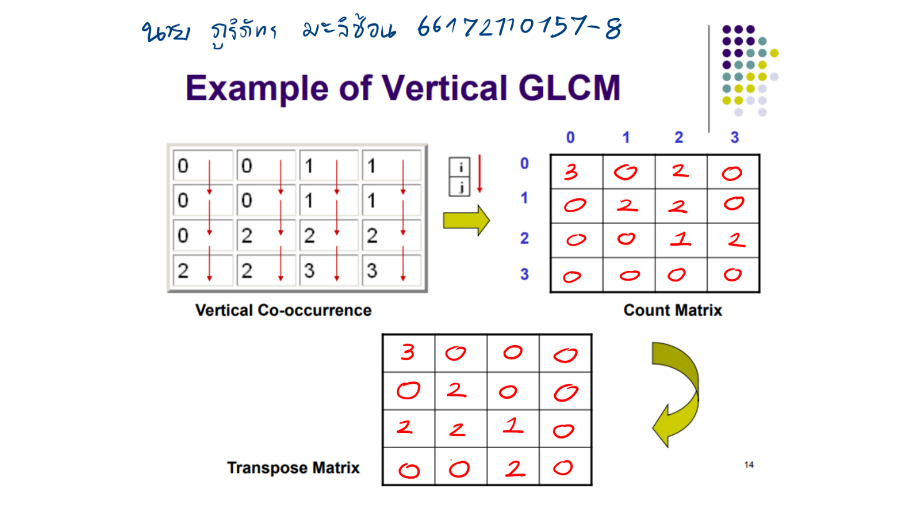
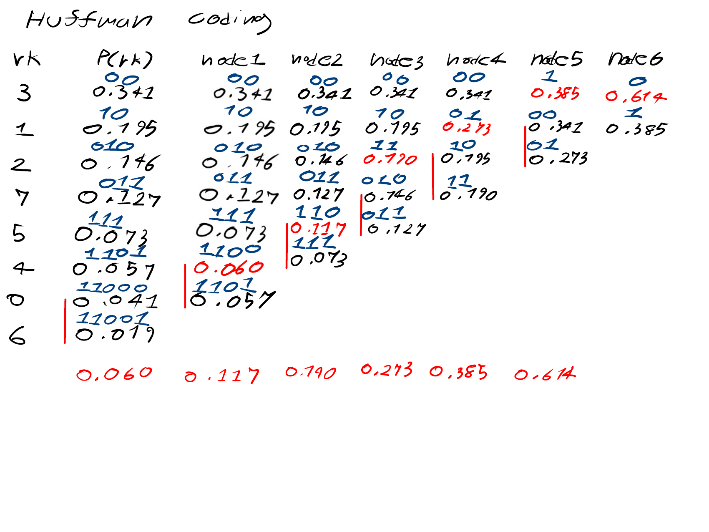
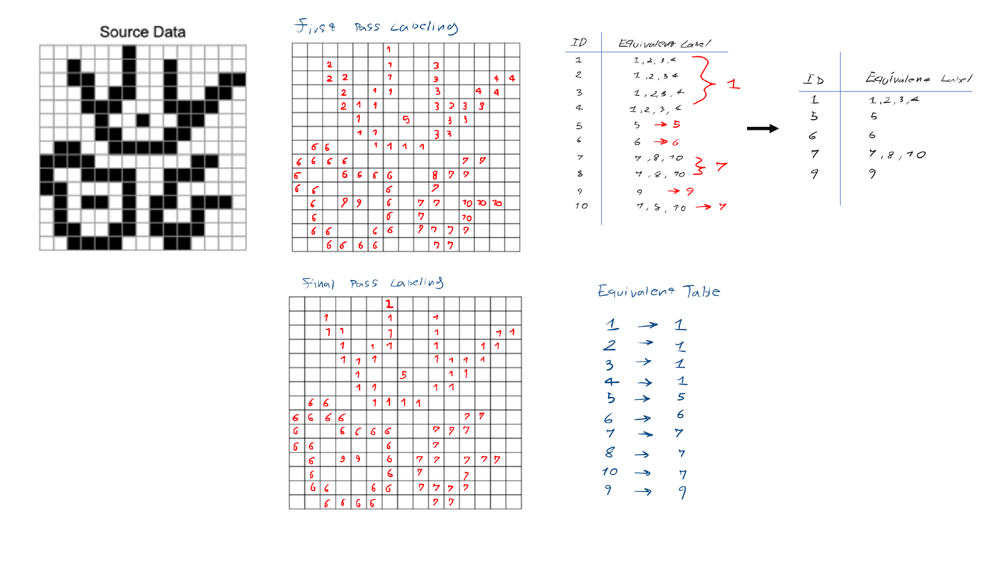

# Computer Vision Coursework

รวมแบบฝึกหัดและการประมวลผลภาพดิจิทัลในรายวิชา Computer Vision ครอบคลุมการคำนวณคุณลักษณะภาพ, การบีบอัดข้อมูล และการวิเคราะห์ภาพดิจิทัล

---

## 1. Texture Segmentation — GLCM (Gray-Level Co-occurrence Matrix)

การสกัดคุณลักษณะเนื้อสัมผัสของภาพโดยการสร้างเมทริกซ์การเกิดร่วมระดับสีเทา (GLCM) จากพิกเซลในทิศทางต่าง ๆ พร้อมคำนวณค่า Contrast, Similarity และ Dissimilarity เพื่อใช้ในการแบ่งส่วนภาพ

📄 [ดูเอกสารและผลการคำนวณฉบับเต็ม (10 หน้า)](texture-segmentation/answers.pdf)

---

## 2. Huffman Coding

การบีบอัดข้อมูลภาพแบบไม่สูญเสียรายละเอียด (Lossless Data Compression) โดยคำนวณความน่าจะเป็นของระดับความสว่างพิกเซล สร้าง Huffman Tree กำหนดรหัสบิต พร้อมทั้งคำนวณ Average Code Length และ Compression Ratio

📄 [ดูเอกสารและขั้นตอนการเข้ารหัสฉบับเต็ม (5 หน้า)](huffman-coding/answers.pdf)

---

## 3. Connected-Component Labeling

อัลกอริทึมการระบุและจัดกลุ่มวัตถุในภาพไบนารี (Binary Image) โดยการกำหนด Label ให้แก่พิกเซลที่เชื่อมต่อกัน (Connected Pixels) และรวมกลุ่มเพื่อแยกแยะชิ้นส่วนวัตถุในภาพ

📄 [ดูเอกสารและผลลัพธ์ขนาดเต็ม](connected-component-labeling/answers.pdf)
