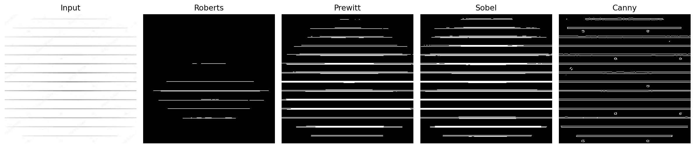

# Mini Project 1 — Edge Detection & Hough Transform

เปรียบเทียบการตรวจขอบด้วย Roberts, Prewitt, Sobel และ Canny แล้วนำไปตรวจเส้นตรงและวงกลมด้วย Hough Transform



ภาพด้านบนเป็นผลรันโค้ดกับภาพ l3.jpg ที่ใช้ในโปรเจกต์

## วิธีเปิด

จากโฟลเดอร์นี้ รัน:

```sh
python HoughLines.py
python HoughCircles.py
```

HoughLines เปิดผลของทั้ง 4 วิธี ส่วน HoughCircles มีแถบเลื่อนปรับค่าการตรวจวงกลม กด Esc เพื่อปิดหน้าวงกลม
ไฟล์ Robert.py, Prewitt.py, Sobel.py และ Canny.py เป็นฟังก์ชันที่สองโปรแกรมเรียกใช้ จึงต้องเก็บไว้ด้วยกัน
